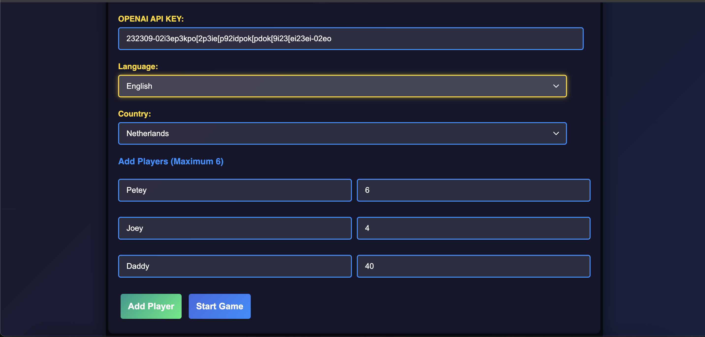
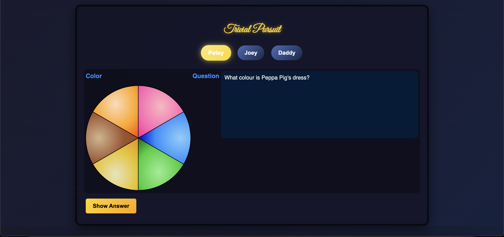
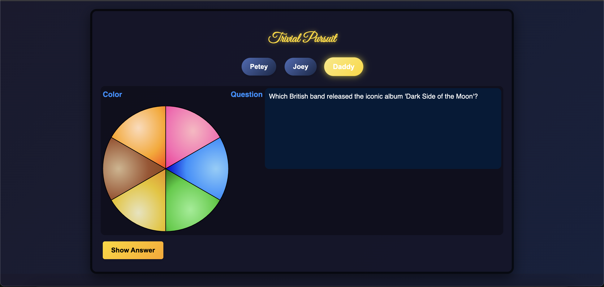

**AI Generated Trivial Pursuit Questions**
This web application (which completely runs in the front end, so only a static web page server is needed) will generatee a trivia questions based on the player's age and country of origin.

The questions are generated using the OpenAI API, all you require is an OpenAI API key, that you will enter in the setup form.

The players select their age and country of origin, and the questions are generated using the OpenAI API.

The questions are age appropriate and relevant to the player's country of origin.

***Kid questions***


***Adult questions***


**More fun for the whole family**
This way the 80s classic "Trival Pursuit" can be played by the whole family, even the youngest ones, spending wholesome time together. And at the same time the whole family can learn something new about the world and each other's generations.

***How did this project come to be?***
As a kid I used to play Trivial Pursuit with my family, but the questions were always very hard because they were all aimed at "Boomers" and "Silent Generation" people. Us GenX kids were always left out.
Recently I bought the game again to play with my old-folks over Christmas. Now the tables were turned, these questions were aimed at us Millenials and GenX, and my parents were left out.
And the decider came when friends (Millenials and I as a GenXer) played the game and the questions were aimed at Boomers and Silent Generation, I was able to answer more than them, but for all of us the fun was gone after 30 minutes. And since the also have 3 adorble kids, who love to play boardgames with their parents, I decided to make a web app that will generate trivia questions based on the player's age. My friend suggested to add the country to get country specific trivia questions for the kiddies. Because we got this weird question for a 4 year old: "What game is played with bat and ball?" Kid's in the Netherlands play "korfbal" (field hockey) and "voetbal" (soccer), but the question was "What game is played with bat and ball?" -- how would they know that is either Baseball or Cricket? So we tightened that up.

It is beyond me why PARKER (the publisher of Trivial Pursuit) did not do this, but I am glad I did!!! All we now need is autumn and winnter to play Trivial Pursuit with the friends and their family.

***How to run the project***
You simply run a small web server, I use http-server, but you can use any web server.
```
http-server -d public
```
And you serve to that url in your browser. You can host this for free on Azure or AWS, or any other cloud provider as it is a tiny static web page.

**Costs**

The cost for the OpenAI API is relatively high. If you know something about LLMs, then you know they don't have an "active" state. There for in order to refrain from getting the same question over and over again in the same session, we need to feed back the questions that have been served in so called "assistant prompts". So slowly over the game the cost will go up. I estimate the cost to be around 1.5 cent per question. This is also because we are using the most expensive model, the 4 turbo model -- which is required in order to be aware about the different countries and languages. OpenAI gpt-4-turbo does a great job in finding age  and location appropriate questions. When prices will eventually come down, we will probably pay about 10cents for a whole game.

